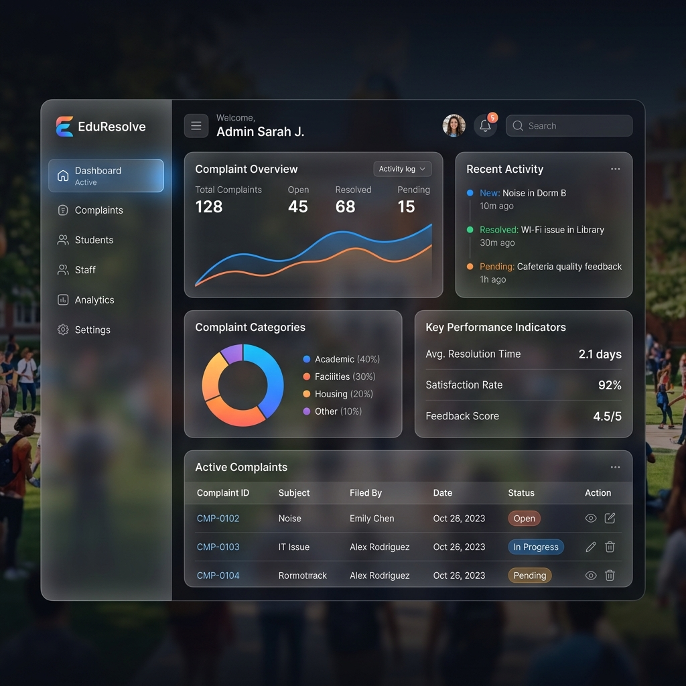

<h1 align="center">Campus Complaint Management System</h1>

<div align="center">


**A premium, next-generation complaint management platform for educational institutions featuring a stunning glassmorphic UI, role-based access control, and automated workflows.**

</div>

---

## 🌟 Overview
The Campus Complaint Management System is a comprehensive platform designed to streamline issue reporting and resolution within an educational institution. It provides dedicated interfaces for Students, Staff, and Administrators to ensure transparent and quick problem-solving.

<div align="center">
  
</div>

This project features a **modern glassmorphism design system** with vibrant gradients, blurred translucent backgrounds, and engaging micro-animations.

## ✨ Key Features
### 🔐 Authentication & Authorization
- **Role-Based Access Control** - Dedicated, tailored dashboards for Students, Staff, and Administrators.
- **Secure Authentication** - JWT-based session handling and bcrypt password encryption.

### 📝 Complaint Management
- **Smart Submission** - Submit complaints with urgency levels, categories, and image evidence uploads.
- **Real-Time Tracking** - Transparent status workflow: `Pending` → `In-progress` → `Resolved`.

### 👨‍💼 Admin & Staff Operations
- **Staff Dashboard** - Manage assigned complaints and add resolution photos/remarks instantly.
- **Admin Analytics** - Comprehensive oversight with real-time metrics, user lists, and staff assignment tools.

---

## 🛠 Tech Stack
- **Frontend:** React, React Router, Bootstrap, Custom CSS (Premium Glassmorphism & Gradients)
- **Backend:** Node.js, Express.js
- **Database:** MongoDB, Mongoose
- **Utilities:** Multer (File Uploads), Nodemailer (Emails), JWT

---

## 🚀 Quick Start Guide

### 1. Clone the Repository
```bash
git clone https://github.com/SinghManavi-99/camplaint_management.git
cd camplaint_management
```

### 2. Environment Setup
Create a `.env` file in the `server` directory and add the following variables:
```env
MONGO_URI=your_mongodb_connection_string
JWT_SECRET=your_jwt_secret_key
PORT=5000
EMAIL_USER=your_email@gmail.com
EMAIL_PASS=your_app_password
ADMIN_EMAIL=admin@campus.edu
ADMIN_PASSWORD=secure_admin_password
```

### 3. Install & Run (The Easy Way)
We have greatly simplified the developer experience. From the **root folder**, simply run:

```bash
# 1. Install dependencies for the root, frontend, and backend all at once
npm run install-all

# 2. Start both the frontend and backend concurrently
npm start
```

*The Client will open at `http://localhost:3000` and the Server will run at `http://localhost:5000`.*

---

## 🤝 Contributing
Contributions are always welcome! Feel free to open issues or submit pull requests. 

<div align="center">
Made with ❤️ by Manavi Singh
</div>
